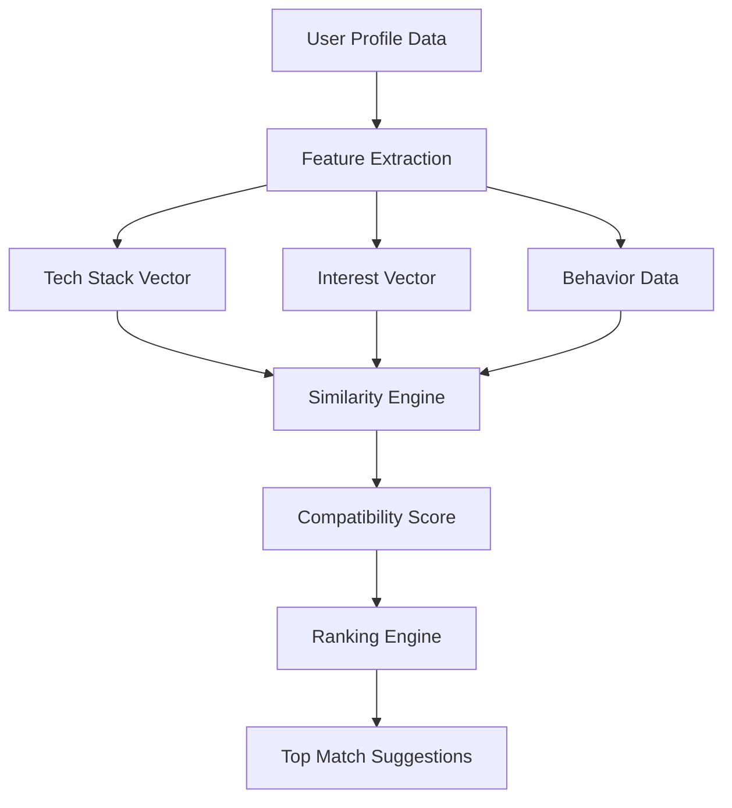

# AI Matchmaking Pipeline

```mermaid
flowchart TD

A[User Profile Data] --> B[Feature Extraction]

B --> C[Tech Stack Vector]
B --> D[Interest Vector]
B --> E[Behavior Data]

C --> F[Similarity Engine]
D --> F
E --> F

F --> G[Compatibility Score]

G --> H[Ranking Engine]

H --> I[Top Match Suggestions]
```
