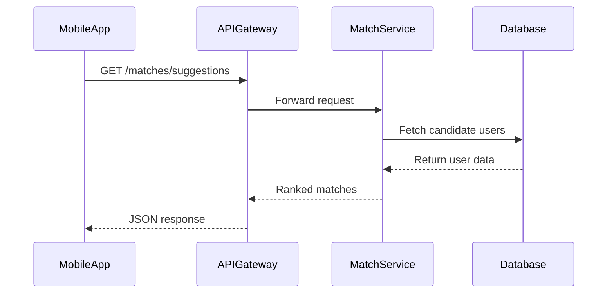

# API Request / Response Cycle

```mermaid
sequenceDiagram

participant MobileApp
participant APIGateway
participant MatchService
participant Database

MobileApp->>APIGateway: GET /matches/suggestions
APIGateway->>MatchService: Forward request
MatchService->>Database: Fetch candidate users
Database-->>MatchService: Return user data
MatchService-->>APIGateway: Ranked matches
APIGateway-->>MobileApp: JSON response
```
