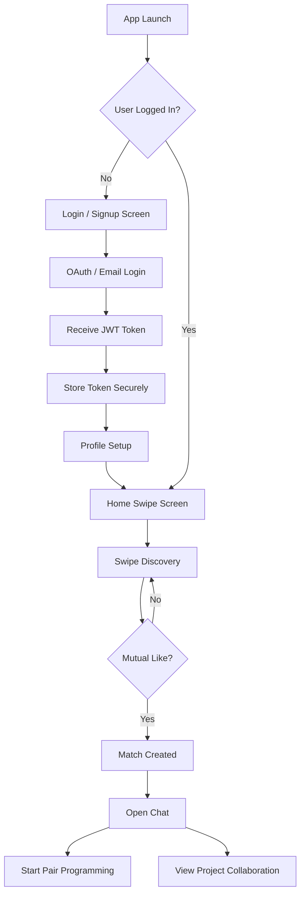

# App Navigation & Route Guard Flow

```mermaid
flowchart TD

A[App Launch] --> B{User Logged In?}

B -- No --> C[Login / Signup Screen]
C --> D[OAuth / Email Login]
D --> E[Receive JWT Token]
E --> F[Store Token Securely]

F --> G[Profile Setup]
G --> H[Home Swipe Screen]

B -- Yes --> H

H --> I[Swipe Discovery]

I --> J{Mutual Like?}

J -- No --> I
J -- Yes --> K[Match Created]

K --> L[Open Chat]
L --> M[Start Pair Programming]
L --> N[View Project Collaboration]
```
