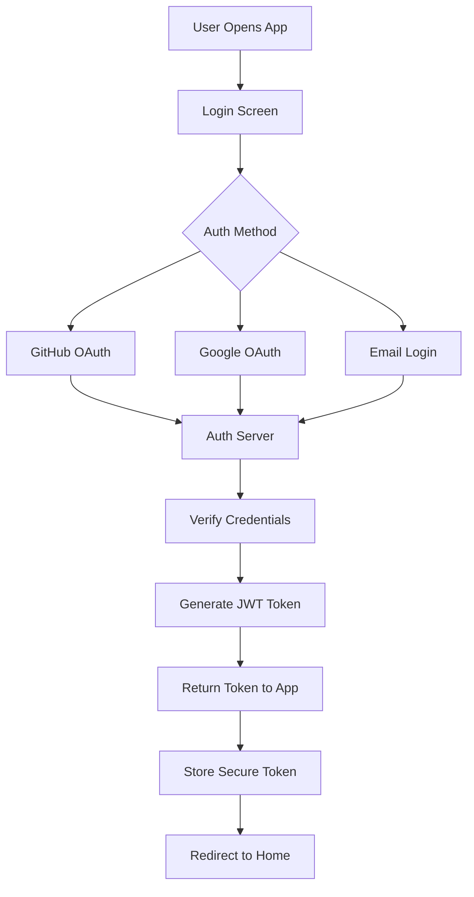

# Authentication Flow

```mermaid
flowchart TD

A[User Opens App] --> B[Login Screen]

B --> C{Auth Method}

C --> D[GitHub OAuth]
C --> E[Google OAuth]
C --> F[Email Login]

D --> G[Auth Server]
E --> G
F --> G

G --> H[Verify Credentials]
H --> I[Generate JWT Token]

I --> J[Return Token to App]
J --> K[Store Secure Token]

K --> L[Redirect to Home]
```
