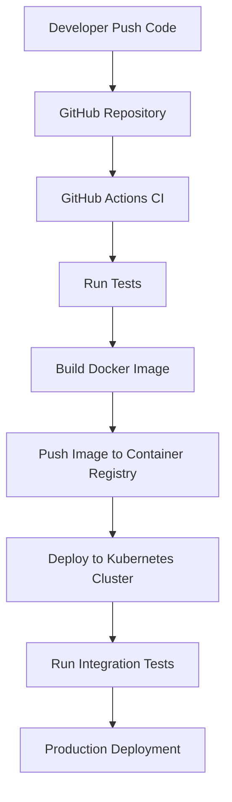

# CI/CD Pipeline

```mermaid
flowchart TD

A[Developer Push Code] --> B[GitHub Repository]

B --> C[GitHub Actions CI]

C --> D[Run Tests]

D --> E[Build Docker Image]

E --> F[Push Image to Container Registry]

F --> G[Deploy to Kubernetes Cluster]

G --> H[Run Integration Tests]

H --> I[Production Deployment]
```
