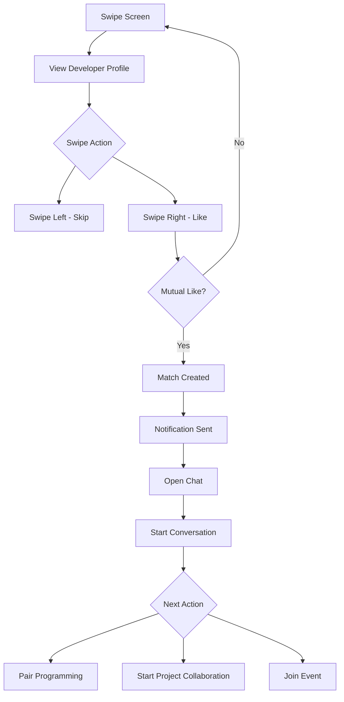

# Discovery → Match → Chat User Journey

```mermaid
flowchart TD

A[Swipe Screen] --> B[View Developer Profile]

B --> C{Swipe Action}

C --> D[Swipe Left - Skip]
C --> E[Swipe Right - Like]

E --> F{Mutual Like?}

F -- No --> A
F -- Yes --> G[Match Created]

G --> H[Notification Sent]

H --> I[Open Chat]

I --> J[Start Conversation]

J --> K{Next Action}

K --> L[Pair Programming]
K --> M[Start Project Collaboration]
K --> N[Join Event]
```
