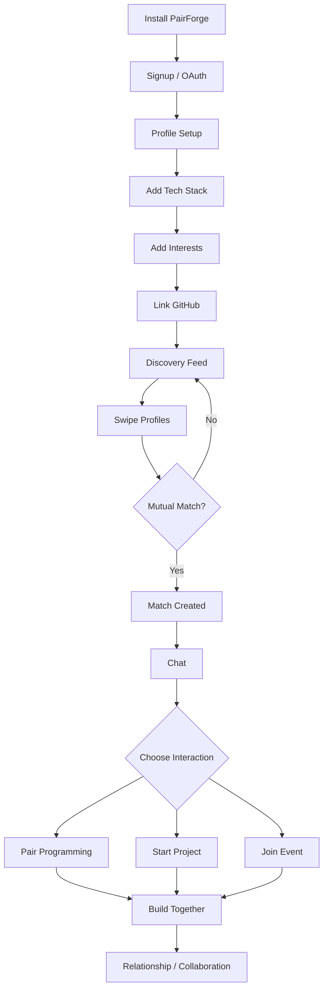

# Full User Lifecycle

```mermaid
flowchart TD

A[Install PairForge] --> B[Signup / OAuth]

B --> C[Profile Setup]

C --> D[Add Tech Stack]
D --> E[Add Interests]
E --> F[Link GitHub]

F --> G[Discovery Feed]

G --> H[Swipe Profiles]

H --> I{Mutual Match?}

I -- No --> G
I -- Yes --> J[Match Created]

J --> K[Chat]

K --> L{Choose Interaction}

L --> M[Pair Programming]
L --> N[Start Project]
L --> O[Join Event]

M --> P[Build Together]
N --> P
O --> P

P --> Q[Relationship / Collaboration]
```
