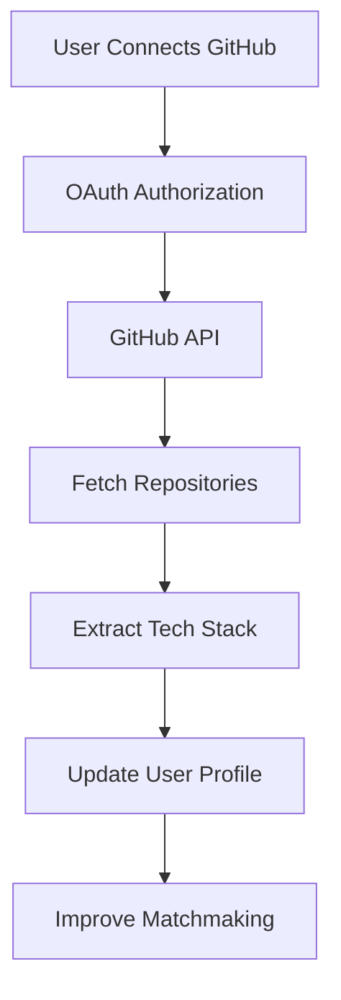

# GitHub Integration Flow

```mermaid
flowchart TD

A[User Connects GitHub] --> B[OAuth Authorization]

B --> C[GitHub API]

C --> D[Fetch Repositories]

D --> E[Extract Tech Stack]

E --> F[Update User Profile]

F --> G[Improve Matchmaking]
```
