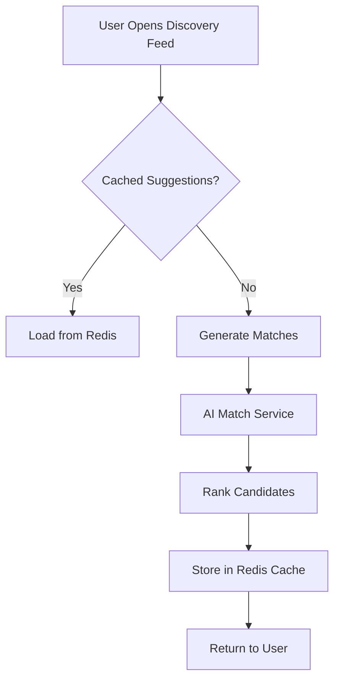

# Match Suggestion Cache System

```mermaid
flowchart TD

A[User Opens Discovery Feed]

A --> B{Cached Suggestions?}

B -- Yes --> C[Load from Redis]

B -- No --> D[Generate Matches]

D --> E[AI Match Service]

E --> F[Rank Candidates]

F --> G[Store in Redis Cache]

G --> H[Return to User]
```
