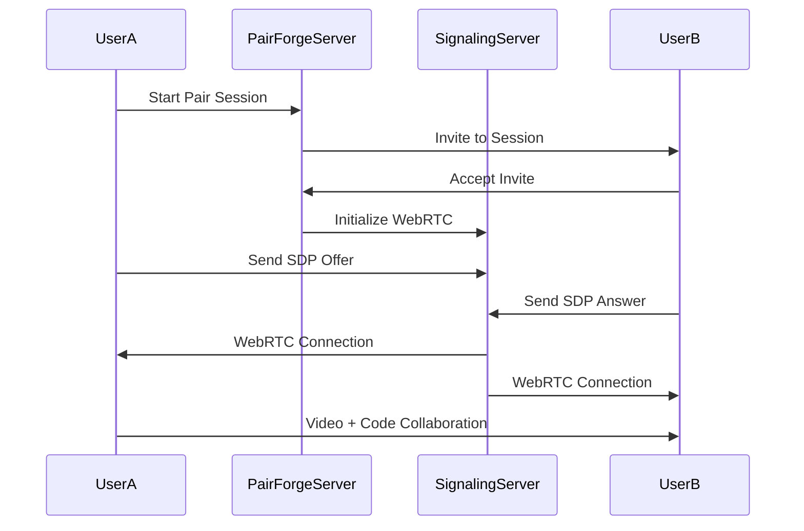

# Pair Programming Session Flow

```mermaid
sequenceDiagram

participant UserA
participant PairForgeServer
participant SignalingServer
participant UserB

UserA->>PairForgeServer: Start Pair Session
PairForgeServer->>UserB: Invite to Session

UserB->>PairForgeServer: Accept Invite

PairForgeServer->>SignalingServer: Initialize WebRTC

UserA->>SignalingServer: Send SDP Offer
UserB->>SignalingServer: Send SDP Answer

SignalingServer->>UserA: WebRTC Connection
SignalingServer->>UserB: WebRTC Connection

UserA->>UserB: Video + Code Collaboration
```
