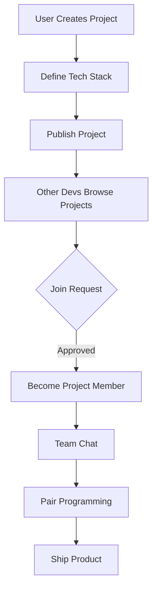

# Project Collaboration Flow

```mermaid
flowchart TD

A[User Creates Project] --> B[Define Tech Stack]

B --> C[Publish Project]

C --> D[Other Devs Browse Projects]

D --> E{Join Request}

E -- Approved --> F[Become Project Member]

F --> G[Team Chat]
G --> H[Pair Programming]
H --> I[Ship Product]
```
