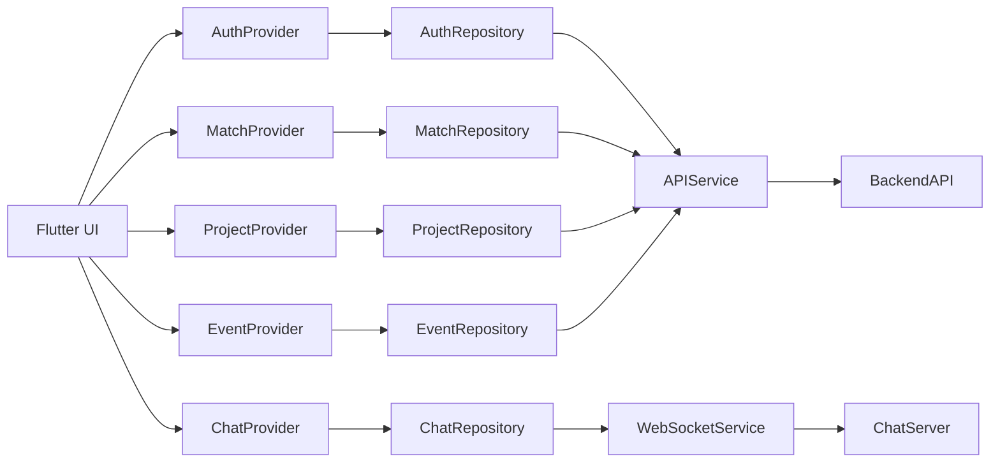

# Riverpod Dependency Graph

```mermaid
graph LR

UI[Flutter UI] --> AuthProvider
UI --> MatchProvider
UI --> ChatProvider
UI --> ProjectProvider
UI --> EventProvider

AuthProvider --> AuthRepository
MatchProvider --> MatchRepository
ChatProvider --> ChatRepository
ProjectProvider --> ProjectRepository
EventProvider --> EventRepository

AuthRepository --> APIService
MatchRepository --> APIService
ChatRepository --> WebSocketService
ProjectRepository --> APIService
EventRepository --> APIService

APIService --> BackendAPI
WebSocketService --> ChatServer
```
