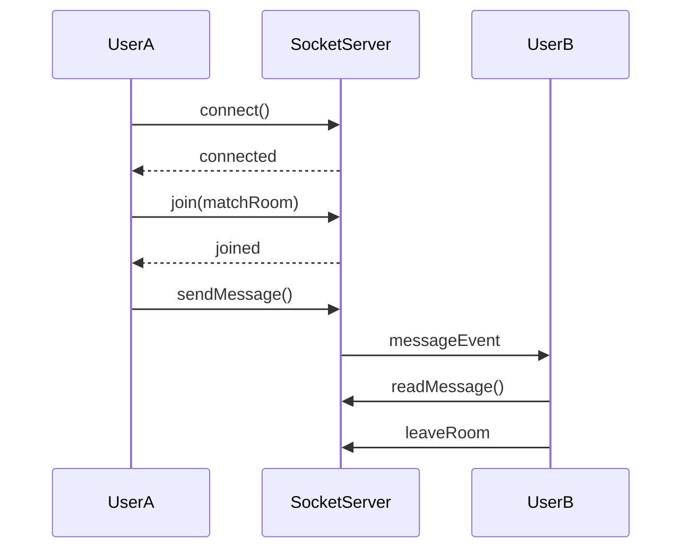

# Socket.IO Event Flow

```mermaid
sequenceDiagram

participant UserA
participant SocketServer
participant UserB

UserA->>SocketServer: connect()
SocketServer-->>UserA: connected

UserA->>SocketServer: join(matchRoom)
SocketServer-->>UserA: joined

UserA->>SocketServer: sendMessage()

SocketServer->>UserB: messageEvent

UserB->>SocketServer: readMessage()

UserB->>SocketServer: leaveRoom
```
